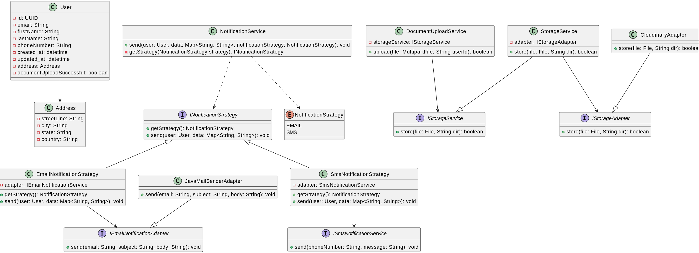

# Lightit Challenge

## Prerequisites

- **Docker Compose** or **Docker Desktop** installed
- **Curl** installed (only for the _Try it_ section)
- Google account credentials (given via mail)
- Properties file (given via mail)

## Project Setup

#### 1. Run app locally

Add the properties file in the `/src/main/resources` and name it `application-beta.properties`.

Run the following command to create the development environment using docker.

```bash
docker compose up
```

This will setup the database and run the app.

#### 2. Log in to third party services

Third party services were used in this project. All of them can be accessed with the provided google account _(using google sso)_.

##### Mailtrap

Mailtrap sandbox smtp server was used to simulate sending email notifications.
Go to [mailtrap website](https://mailtrap.io/inboxes/3533850) and sign in using the provided google account. There you will be able to see the emails sent by the application.

##### Cloudinary

Cloudinary was used to upload patients' document images, enhancing the application's scalability.
Go to [cloudinary website](https://console.cloudinary.com/pm/c-1d87e8982cdd51515ada58a0c92a5a/media-explorer) and sign in using the provided google account. There you will be able to see the documents stored by the application.

## Try it

Cd into the `/tryit` directory where you'll be able to find four requests to try the application's behaviour.

```bash
cd tryit
```

To run a request with missing fields, run:

```bash
sh missing_fields_request.sh
```

To run a request with an invalid file type, run:

```bash
sh invalid_file_type_request.sh
```

To run a request with an invalid phone number format, run:

```bash
sh invalid_phone_number_request.sh
```

To run a successful request, run:

```bash
sh successful_request.sh
```

The successful request will save the user data to the database, store the document in cloudinary and send an asyncronous email to the user.

## Documentation

You can find the class diagram image in the `/documentation` directory


